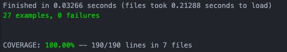

# Bank Tech Test

This is my solution to [this](https://github.com/makersacademy/course/blob/master/individual_challenges/bank_tech_test.md) practice tech test, written in Ruby.  

This program simulates a simple bank account. It allows money to be added and withdrawn, keeps track of the total balance, creates and prints a statement of transactions and handles a number of edge cases.  

## Instructions for usage

Open your terminal and navigate to a directory in which you would like to save this repo to, then enter the following commands:  

```
$ git clone https://github.com/AdamusBG/bank_practice_tech_test.git
$ cd bank_practice_tech_test
$ irb
```

This will open the interactive Ruby (irb) REPL.  

The require statements below must be entered for the program to work, the rest is example usage.  

```
2.7.0 :001 > require './lib/account.rb'

2.7.0 :002 > require './lib/account_printer.rb'
 => true
2.7.0 :003 > require './lib/transaction.rb'
 => true
2.7.0 :004 > my_account = Account.new
 => #<Account:0x00007f91d...
2.7.0 :005 > my_account.add(1000)
 => [#<Transaction:0x00007...
2.7.0 :006 > my_account.withdraw(500)
 => [#<Transaction:0x00007...
2.7.0 :007 > my_account.balance
 => 500
2.7.0 :008 > my_account.statement
date || credit || debit || balance
13/01/2021 || 1000.00 || || 1000.00
13/01/2021 || || 500.00 || 500.00
 => nil
```

## Specification

I have adapted the full specification (found [here](https://github.com/makersacademy/course/blob/master/individual_challenges/bank_tech_test.md)) into a number of user stories and the class diagram below.

### User stories

As a bank customer,  
So I can keep track of my income and expenses,  
I would like to be able to specify a date for transactions.  

As a bank customer,  
So I know how much money I have,  
I would like for my bank balance to be automatically updated after each transaction.  

As a bank customer,  
So I can add money to my account,  
I would like to be able to set up payments into my account (credits).  

As a bank customer,  
So I can buy things with my account,  
I would like to be able to set up payments from my account (debits).  

### Class diagram

This was the class diagram which I created when planning, in the full program there were several additional private methods.


## Code quality

I have written 27 Rspec tests, covering 100% of the code as well as several feature tests to prove the program works as a whole. To run the tests, navigate into the bank_practice_tech_test directory from your terminal and enter `rspec`.  



The program is written to account for the following edge cases, with test coverage proving:
* Negative withdrawals and deposits are blocked.  
* Withdrawals that would take the account below 0 balance are blocked.  
* Invalid dates given for transactions are blocked.
* Transactions will be sorted into correct order automatically.

I have ensured that the code is readable and understandable by following ruby conventions - tested using the RuboCop linter.
